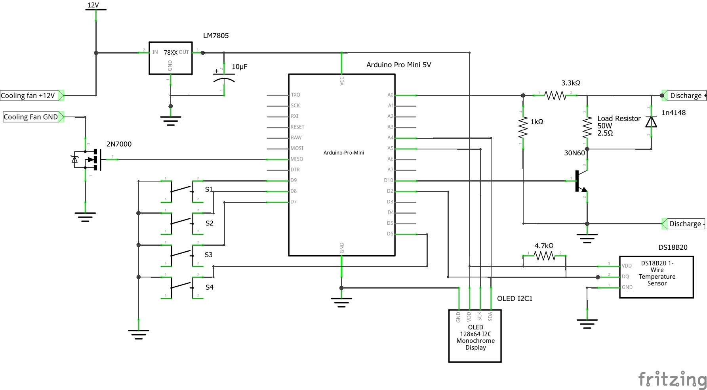

# QuadMeUp Discharger

# Parts

* [Arduino Pro Mini 5V](http://bit.ly/2DjkkHZ)
* [30N60](http://bit.ly/2OXKuSS) power transistor
* 4 x [10Ohm 50W load resistors](http://bit.ly/2DOTloE)
* [0.96" OLED I2C display](http://bit.ly/2PTBaAX)
* [LM7805](http://bit.ly/2QhipeR) voltage stabilizer
* [DS18B20](http://bit.ly/2REWdrJ) digital temperature sensor
* 10uF 16V electrolitic capacitor
* 1kOhm resistor
* 3.3kOhm resistor
* 4.7kOhm resistor
* some cables, plugs, DIY equipment 

# Diagram

# Dependencies

* [Adafruit SSD1306 OLED Library](https://github.com/adafruit/Adafruit_SSD1306)
* [OneWire Library](https://github.com/PaulStoffregen/OneWire)
* [DallasTemperature Library](https://github.com/milesburton/Arduino-Temperature-Control-Library)